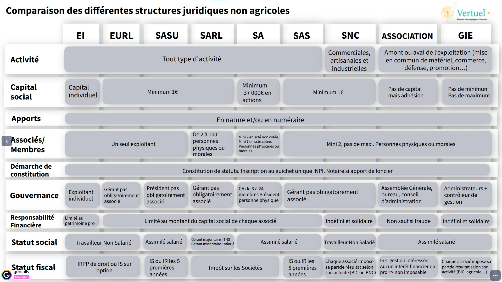

# Les Status Juridiques

## definitions

**status juridique**

> le status juridique est la forme revetue par une entreprise

il donne une indication sur la structure de l'entreprise et sur le cadre juridique dans lequel elle nait, evolue et interagit avec ses partenaires.

il a des impacts dans de nombreux domaines :
- comptable
- fiscal
- social
- commercial

le status juridique ne doit pas etre confondu avec le **status de l'entreprise**.
Ces derniers correspondent a un document ecrit et signe des associes, qui recense toutes les particularites d'une societe et les regles qui s'y appliquent (regles, apport en capitaux, fonctionnement).

## les differentes forme juridique de l'entreprise

Pour choisir son status, il convient de se poser la question du role de l'entreprise.

1. activite agricole
> activite qui participe au cycle de croissance animal ou vegetal

- activite de prolongement agricole
> activite de transformation des produits de l'exploitation

- activite accessoire ayant comme support l'exploitation
> acceuil de touriste a la ferme

2. activite commerciale

- achat/revente
> achat de lait pour la production de fromage

(lorsqu'on ne produit pas la matiere premiere)

- prestation de service
> Gestion de culture pour autrui

- activite artisanal
> production / transformation / services
ex : le boulanger, le boucher (ne produit pas sa matiere premiere)

3. activite liberale

- prestation intellectuelles
> expert foncier, la formation en technique culturale

## Activite agricole, commerciale, artisanale ou liberale?

les questions a se poser lors de la creation d'entreprise :
- quelle est l'activite principale de l'entreprise (celle qui realise le plus de chiffre d'affaire) ?
- qu'est ce que cela implique en termes de droit (foncier, aide ...) ?

la creation se fait ensuite au travers de l'**INPI** sur le gichet unique depuis le 1er janvier 2023

## recapitulatif

